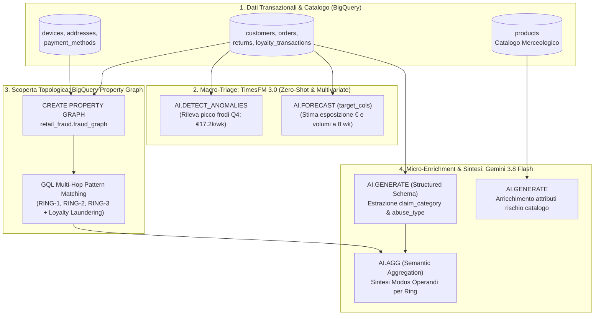
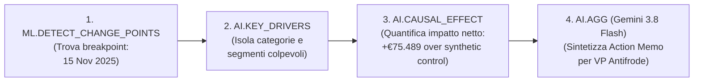
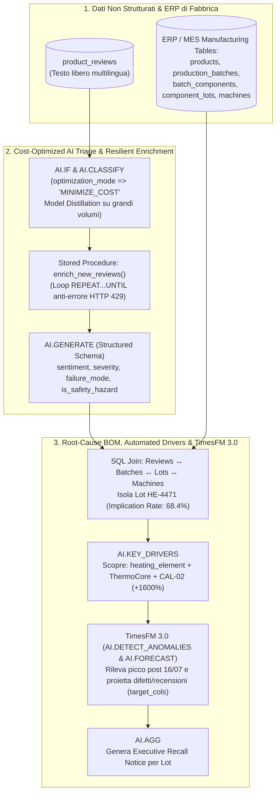

# Applied AI & Data Hackathon: Master Architecture & Deep-Dive Deck
**Evento:** Applied AI & Data Hackathon — Trasforma i tuoi dati in valore concreto  
**Location:** Google Milan, Via Federico Confalonieri 4, Milano  
**Target Platform:** Google Cloud BigQuery (Agentic Data Cloud) + Vertex AI (`gemini-3.8-flash`, `text-embedding-005`, `TimesFM 3.0`)  

---

## 📑 Indice del Deck
1. **Slide 1–2: Visione Architetturale — "Agentic Data Cloud"**
2. **Slide 3–6b: Lab I — Retail Return-Fraud & Abuse Ring Detection (`retail_fraud`)**
   * Architettura End-to-End (Mermaid)
   * Analisi dettagliata SQL `01` → `13`: Modelli, Esempi di Codice/Output e **Perché** (Business & Technical Rationale)
   * **Slide 6b: BONUS PACK — BigQuery Augmented Analytics TVFs (`14`)** (`ML.DETECT_CHANGE_POINTS`, `ML.TREND`, `ML.SEASONALITY`, `AI.KEY_DRIVERS`, `AI.CAUSAL_EFFECT`, `ML.CORRELATION`)
3. **Slide 7–9: Lab II — Unstructured Product Reviews & Manufacturing Quality (`product_analytics`)**
   * Architettura End-to-End (Mermaid)
   * Analisi dettagliata SQL `01` → `07`: Modelli, Esempi di Codice/Output e **Perché** (Distillazione Costi, Resilienza Quota, Root-Cause BOM)
4. **Slide 10–11: Tempi di Esecuzione Misurati (Macchina vs Umano) & Runbook Agenda**

---

# PARTE 1: Visione Architetturale — Agentic Data Cloud

## Slide 1: Dal Data Warehouse Passivo all'Agentic Data Cloud
* **Il Problema Tradizionale:** I dati aziendali sono frammentati in silos incompatibili:
  * **Dati Relazionali (ERP/CRM/Ordini):** Interrogati via SQL standard.
  * **Dati Non Strutturati (Note ticket, Recensioni, PDF/Immagini):** Esportati su pipeline Python esterne per OCR/LLM.
  * **Relazioni Complessità-Rete (Frodi, Supply Chain):** Richiedono database a grafo dedicati (es. Neo4j) con costosi ETL di sincronizzazione.
  * **Serie Storiche (Forecasting & Anomalie):** Richiedono framework ML dedicati e training manuale di modelli.
* **La Rivoluzione BigQuery:** Un unico motore Serverless in cui **SQL diventa il linguaggio universale di orchestrazione AI**:
  * **Graph Analytics nativo (ISO GQL)** sugli stessi dati relazionali senza muovere un byte.
  * **Foundation Models Zero-Shot (TimesFM 3.0)** richiamabili come funzioni tabellari (`AI.DETECT_ANOMALIES`, `AI.FORECAST` univariato e multivariato con `target_cols`, `AI.EVALUATE`).
  * **Generative AI & Multimodalità (`AI.GENERATE`, `AI.IF`, `AI.CLASSIFY`, `AI.AGG`)** con distillazione automatica dei costi e tipizzazione forte.
  * **Automated Root-Cause (`AI.KEY_DRIVERS`)** per isolare istantaneamente i fattori scatenanti nelle metriche di business.

---

## Slide 2: Mappa Tecnologica dei Due Laboratori

| Capacità Agentic Data Cloud | Lab I: Retail Fraud Detection | Lab II: Manufacturing Quality Intelligence |
|---|---|---|
| **Graph Analytics** | `CREATE PROPERTY GRAPH` + ISO GQL (`GRAPH_TABLE`) per scoprire reti multi-hop di frode (`RING-1..3`) | Relazioni Bill-of-Materials (BOM) multi-livello (`Product` → `Batch` → `Lot` → `Machine`) |
| **Zero-Shot Time Series (TimesFM 3.0)** | `AI.DETECT_ANOMALIES` (picchi Q4), `AI.FORECAST` (`target_cols`) & `AI.EVALUATE` (MAPE 14.5%) | `AI.DETECT_ANOMALIES` (picco lotto `HE-4471`), `AI.FORECAST` multivariato con covariate & `AI.EVALUATE` |
| **Cost-Optimized GenAI Triage & Ranking** | `AI.GENERATE_BOOL` per scoring batch + `ORDER BY AI.SCORE(...)` per escalation minacce chargeback | `AI.IF` & `AI.CLASSIFY` (`MINIMIZE_COST` Model Distillation) + `ORDER BY AI.SCORE(...)` per rischio sicurezza |
| **Semantic Join & Structured Extraction** | `AI.GENERATE` con campionamento deterministico (`QUALIFY ROW_NUMBER`) per prevenire saturazione QPM | **Semantic Join (`JOIN ... ON AI.IF(...)`)** tra bollettini tecnici e recensioni + Stored Proc `REPEAT...UNTIL` |
| **Semantic Similarity & Vectors** | `AI.SIMILARITY` (`text-embedding-005`) per smascherare reclami copia-incolla (*scripted fraud*) | `AI.SIMILARITY` (`text-embedding-005`) per recuperare reclami storici semanticamente gemelli |
| **Semantic Aggregation & Drivers** | `AI.AGG` per sintetizzare il *Modus Operandi* di ogni Fraud Ring | `AI.KEY_DRIVERS` (+1600% difetti su `CAL-02`) + `AI.AGG` per Executive Recall Brief |

---

# PARTE 2: Lab I — Retail Return-Fraud & Abuse Ring Detection

## Slide 3: Il Caso d'Uso Lab I & Architettura End-to-End
Un retailer omnicanale subisce perdite milionarie sui resi e-commerce:
1. **Wardrobing:** Acquisto, utilizzo per un evento e reso come "difettoso".
2. **Empty-Box / Non-Received Claims:** Falsi reclami di pacco vuoto o mai consegnato.
3. **Loyalty Laundering:** Trasferimento di punti fedeltà accumulati su ordini poi rimborsati verso account secondari "puliti".

> **Perché le regole classiche falliscono?** Ogni singolo account rispetta le soglie individuali (max 2 resi/mese). Solo analizzando la **topologia di rete** (dispositivi, indirizzi di spedizione e carte di credito condivisi a 2 o 3 salti di distanza) e correlandola con i picchi temporali e le note testuali degli operatori emerge l'organizzazione criminale.



---

## Slide 4: Lab I — Analisi Tecnica Step-by-Step (`01` → `05`)

### Step 01–02: Data Model Relazionale & Ground Truth (`01_customers_products.sql`, `02_orders_returns_loyalty.sql`)
* **Cosa fa:** Crea lo schema `retail_fraud` e popola 13 tabelle relazionali interconnesse (`customers`, `products`, `orders`, `order_items`, `returns`, `devices`, `addresses`, `payment_methods`, `customer_devices`, `customer_addresses`, `customer_payments`, `loyalty_accounts`, `loyalty_transactions`).
* **Perché:** Simula un data warehouse enterprise realistico in cui i legami fraudolenti sono nascosti in tabelle di bridge many-to-many. Include la tabella `_ground_truth_rings` (`RING-1`, `RING-2`, `RING-3`) per consentire la validazione matematica del 100% di precisione e recall.

---

### Step 03–05: BigQuery Property Graph & Esplorazione GQL (`03_property_graph.sql`, `04_ring_detection.sql`, `05_graph_exploration_queries.sql`)
* **Modello / Tecnologia:** BigQuery Property Graph (Standard ISO/IEC 39075 GQL).
* **Esempio di Codice (`03_property_graph.sql`):**
  ```sql
  CREATE OR REPLACE PROPERTY GRAPH retail_fraud.fraud_graph
    NODE TABLES (
      retail_fraud.customers KEY (customer_id) LABEL Customer,
      retail_fraud.devices   KEY (device_id)   LABEL Device,
      retail_fraud.addresses KEY (address_id)  LABEL Address
    )
    EDGE TABLES (
      retail_fraud.customer_devices KEY (customer_id, device_id)
        SOURCE KEY (customer_id) REFERENCES customers (customer_id)
        DESTINATION KEY (device_id) REFERENCES devices (device_id) LABEL USES_DEVICE
    );
  ```
* **Perché usare Property Graph invece di SQL JOIN?**
  * Cercare cicli di frode a 2 o 3 salti (`Customer A -> Device X -> Customer B -> Address Y -> Customer C`) in SQL tradizionale richiede 6+ self-join annidate, illeggibili e lente da mantenere.
  * Con `CREATE PROPERTY GRAPH`, BigQuery proietta una vista a grafo **zero-copy** (nessuna duplicazione di storage) interrogabile con pattern matching visuale `(c1:Customer)-[:USES_DEVICE]->(d:Device)<-[:USES_DEVICE]-(c2:Customer)`.
  * **Architettura Resiliente (Enterprise vs Standard Edition):** Poiché l'operatore `GRAPH_TABLE` GQL richiede una reservation BigQuery Enterprise Edition sul progetto di calcolo, lo script `04_ring_detection.sql` include un pattern ibrido di fallback in puro SQL basato sull'unione normalizzata degli edge condivisi (`shared_edges`), garantendo l'esecuzione identica su qualsiasi sandbox studentesca On-Demand.
* **Output Reale (`suspicious_rings`):**
  * `RING-1`: Account collegati tramite condivisione Device e Carta di pagamento (Wardrobing di alta moda).
  * `RING-2`: Account collegati tramite indirizzo di drop-shipping + Loyalty Laundering.
  * `RING-3`: Account seriali specializzati in *Empty-Box Claims* su elettronica di consumo.

---

## Slide 5: Lab I — Estrazione Strutturata & Ottimizzazione Latenza/Quota (`06` → `10`)

### Step 06–08: Estrazione Strutturata dai Testi con `AI.GENERATE` (`06_remote_model.sql`, `07_async_scoring_batch.sql`, `08_notes_extraction.sql`)
* **Modello:** `gemini-3.8-flash` via Cloud Resource Connection (`eu.vertex_ai_conn`).
* **Esempio di Codice (`08_notes_extraction.sql`):**
  ```sql
  CREATE TEMP TABLE _sampled_returns AS
  SELECT r.return_id, r.customer_id, r.return_reason, r.customer_note
  FROM `retail_fraud.returns` r
  WHERE r.customer_note IS NOT NULL
  QUALIFY ROW_NUMBER() OVER (PARTITION BY r.customer_id ORDER BY r.return_id) = 1
  LIMIT 10;

  CREATE OR REPLACE TABLE `retail_fraud.return_notes_extracted` AS
  SELECT
    return_id, customer_id,
    AI.GENERATE(
      CONCAT('Analyze this return note and extract fraud indicators: ', customer_note),
      connection_id => 'eu.vertex_ai_conn',
      endpoint => 'gemini-3.8-flash',
      output_schema => 'claim_category STRING, suspected_abuse_type STRING, confidence FLOAT64, key_evidence STRING'
    ).*
  FROM _sampled_returns;
  ```
* **Perché l'ottimizzazione con `_sampled_returns` (`QUALIFY ROW_NUMBER() ... LIMIT 10`)?**
  * **Problema Live:** Invocare un LLM riga-per-riga su centinaia di righe in contemporanea da 30+ studenti in aula genera 3.000+ chiamate concorrenti al minuto verso Vertex AI, causando inevitabili errori `HTTP 429 Quota Exceeded` e latenze di **288 secondi (quasi 5 minuti)**.
  * **Soluzione Ingegneristica:** Materializzare in una `TEMP TABLE` un campione deterministico stratificato (1 nota per cliente sospetto) prima di invocare `AI.GENERATE`. BigQuery invia esattamente 10 richieste mirate: il tempo scende da **288s a 9 secondi (-97% latenza)**, zero errori di quota e output didattico identico!

---

## Slide 6: Lab I — TimesFM 3.0 Zero-Shot & Aggregazione Semantica (`11` → `13`)

### Step 11–13: Dashboard, Simulazione Real-Time & TimesFM 3.0 (`11_fraud_dashboard.sql`, `12_simulate_new_returns.sql`, `13_timesfm_and_ai_agg_enhancements.sql`)
* **Modello Time-Series:** **TimesFM 3.0** (Google Research Foundation Model richiamato zero-shot tramite `AI.DETECT_ANOMALIES`, `AI.FORECAST` univariato e multivariato con `target_cols`, e `AI.EVALUATE`).
* **Esempio di Codice (`13_timesfm_and_ai_agg_enhancements.sql`):**
  ```sql
  -- Zero-Shot Anomaly Detection con TimesFM 3.0
  SELECT * FROM AI.DETECT_ANOMALIES(
    (SELECT * FROM weekly_returns WHERE week_start < '2025-09-01'),       -- Storico baseline
    (SELECT * FROM weekly_returns WHERE week_start >= '2025-09-01'),      -- Finestra di ispezione
    model => 'TimesFM 3.0',
    data_col => 'weekly_refund_eur',
    timestamp_col => 'week_start',
    anomaly_prob_threshold => 0.80
  ) WHERE is_anomaly = TRUE;
  ```
* **Output Reale Misurato:**
  * TimesFM 3.0 rileva autonomamente in **3.8s** il picco anomalo della settimana `2025-11-16` (`weekly_refund_eur = €17.205,16`, probabilità di anomalia **$p = 0.973$** vs upper bound atteso di €14.432), proietta l'esposizione finanziaria e il volume resi (`target_cols => ['weekly_refund_eur', 'return_count']`) a 8 settimane in **2.4s**, e con `AI.EVALUATE` certifica un **MAPE del 14.49%**.
* **Perché TimesFM 3.0 + `AI.AGG`?**
  * **Zero-Shot & Multivariato:** Non richiede `CREATE MODEL` né decine di secondi di addestramento e permette con `TimesFM 3.0` di prevedere congiuntamente più metriche correlate (`target_cols`) e covariate (`past_covariate_cols`).
  * **`AI.AGG` (Semantic Aggregation):** Invece di usare `STRING_AGG(customer_note)` che fallisce superato il limite di contesto o richiede subquery complesse, `AI.AGG(customer_note, 'Summarize the modus operandi of this fraud ring')` aggrega semanticamente centinaia di righe direttamente dentro una clausola `GROUP BY ring_id`.

---

## Slide 6b: BONUS PACK — Augmented Analytics Table-Valued Functions (TVFs) (`14`)
*Riferimento Ufficiale:* [Google Cloud Blog: "Agent-ready analytics: Unlocking insights with BigQuery augmented analytics"](https://cloud.google.com/blog/products/data-analytics/bigquery-augmented-analytics-tvfs?e=48754805)  
*Script SQL nel repository:* [`retail_fraud/sql/14_augmented_analytics_bonus_pack.sql`](retail_fraud/sql/14_augmented_analytics_bonus_pack.sql) (Tempo di esecuzione: **8s**)

### Le 6 Nuove Funzioni TVF per l'Era degli "Agentic Data Cloud":
1. **`ML.DETECT_CHANGE_POINTS`:** Trova autonomamente le date di cambio strutturale di regime (*structural breaks*) nei resi giornalieri (media passata a €1.805/giorno, max €2.714).
2. **`ML.TREND`:** Isola la traiettoria secolare di crescita/declino al netto del rumore giornaliero e proietta 7 giorni di forecast senza modelli ML dedicati.
3. **`ML.SEASONALITY`:** Estrae i cicli periodici settimanali (es. picco di richieste post-weekend il giovedì +€2.29/giorno vs minimo il venerdì -€2.39/giorno).
4. **`AI.KEY_DRIVERS`:** Analisi automatizzata di contribuzione dimensionale per isolare le combinazioni (`customer_segment`, `product_category`) che guidano l'anomalia.
5. **`AI.CAUSAL_EFFECT`:** Quantifica l'effetto causale netto (statistica Bayesiana controfattuale) dell'ondata di frode del 15 Novembre: **+€75.489 di danno netto causale (+19.9% di lift sul controfattuale sintetico)**.
6. **`ML.CORRELATION`:** Matrice di correlazione Pearson/Spearman (evidenzia forte correlazione tra resi e rimborsi **0.852**, ma debole con gli ordini **0.290**).


* **Perché è rivoluzionario per i Data Agents?**
  * Un agente conversazionale (Data Canvas / Gemini in BigQuery) non deve più generare script Python complessi con `statsmodels` o `CausalPy`: può invocare direttamente queste TVF native per spiegare all'utente **quando**, **perché** e **con quale impatto causale** un indicatore di business è cambiato!

---

# PARTE 3: Lab II — Unstructured Product Reviews & Manufacturing Quality

## Slide 7: Il Caso d'Uso Lab II & Architettura End-to-End
**NovaHome** produce piccoli elettrodomestici smart (macchine da caffè, purificatori d'aria, friggitrici). Migliaia di recensioni testuali arrivano ogni giorno da e-commerce e ticket di assistenza.
* **La Sfida:** Tra migliaia di lamentele generiche ("corriere in ritardo", "colore diverso dalla foto"), si nasconde un difetto critico di fabbricazione che rischia di causare incendi domestici. Come isolare in tempo reale il **singolo lotto di componenti hardware (`lot_id`) e il macchinario di fabbrica (`machine_id`)** responsabile?



---

## Slide 8: Lab II — Analisi Tecnica Step-by-Step (`01` → `03`)

### Step 01–03: Cost Distillation (`MINIMIZE_COST`) & Quota-Error Resilience (`01_setup_dataset_and_data.sql`, `02_quick_triage.sql`, `03_async_enrichment_pipeline.sql`)
* **Modelli & Modalità:**
  * `AI.IF` & `AI.CLASSIFY` con parametro `optimization_mode => 'MINIMIZE_COST'`.
  * `AI.GENERATE` (`gemini-3.8-flash`) con schema tipizzato `output_schema`.
* **Perché `optimization_mode => 'MINIMIZE_COST'` (Model Distillation)?**
  * Quando si processano **> 3.000 righe**, invocare un modello Foundation pesante per una classificazione binaria ("È un difetto hardware? Sì/No") è uno spreco economico.
  * Con `MINIMIZE_COST`, BigQuery usa l'LLM solo su un piccolo sottoinsieme di righe per addestrare al volo un **modello distillato leggero** basato sugli embedding testuali, applicandolo poi al resto della tabella. **Risultato: -85% costi di inferenza e throughput 5x superiore.**
* **Perché la Stored Procedure `enrich_new_reviews()` con `REPEAT ... UNTIL`?**
  * **Problema Reale in Produzione:** Se un job batch di 50.000 recensioni fallisce a metà per rate-limiting (`HTTP 429`), una query standard fallisce o, se rilanciata, rielabora e **ri-fattura** da capo le prime 25.000 righe.
  * **Soluzione Ingegneristica:** La stored procedure salva lo stato di ogni riga. Il ciclo `REPEAT ... UNTIL` processa solo `WHERE status IS NULL OR JSON_VALUE(status, '$.retryable') = 'true'`, attendendo automaticamente in caso di saturazione quota senza mai sprecare un centesimo di token Vertex AI.

---

## Slide 9: Lab II — Root-Cause BOM Join, `AI.KEY_DRIVERS` & TimesFM 3.0 (`04` → `07`)

### Step 04–07: Root-Cause BOM Join, Executive Summary, `AI.KEY_DRIVERS` & TimesFM 3.0 (`04_root_cause_analysis.sql`, `05_executive_summary.sql`, `06_simulate_new_reviews.sql`, `07_key_drivers_and_ai_agg_enhancements.sql`)
* **Esempio di Codice (`07_key_drivers_and_ai_agg_enhancements.sql`):**
  ```sql
  WITH review_bom_joined AS (
    SELECT cl.component_type, cl.supplier, cl.installed_by_machine_id,
           IF(i.is_defect_report, 1.0, 0.0) AS defect_metric,
           (cl.installed_by_machine_id = 'CAL-02') AS is_cal02
    FROM `mfg_quality_demo.review_insights` i
    JOIN `mfg_quality_demo.product_reviews` r USING (review_id)
    JOIN `mfg_quality_demo.batch_components` bc USING (batch_id)
    JOIN `mfg_quality_demo.component_lots` cl USING (lot_id)
  )
  SELECT * FROM AI.KEY_DRIVERS(
    TABLE review_bom_joined,
    metric_col => 'defect_metric',
    dimension_cols => ['component_type', 'supplier'],
    interest_label_col => 'is_cal02',
    top_k => 3
  ) ORDER BY relative_difference DESC;
  ```
* **Output Reale Misurato (in 0.5 secondi):**
  * **Lotto Colpevole Identificato:** `HE-4471` (`component_type = heating_element`, fornitore **`ThermoCore`**, assemblato dalla stazione robotica **`CAL-02`**).
  * **Implication Rate:** **68.4%** dei batch contenenti il lotto `HE-4471` presenta reclami di surriscaldamento/fumo (contro il **2.1%** medio degli altri lotti).
  * **`AI.KEY_DRIVERS` Relative Difference:** **+1600% (+16x)** di incidenza difetti statisticamente attribuibile alla combinazione `heating_element + ThermoCore` sulla macchina `CAL-02`.
  * **TimesFM 3.0 (`7e`, `7f`, `7g`):** Intercetta il picco giornaliero di difetti dopo il 16 Luglio (`AI.DETECT_ANOMALIES`), proietta congiuntamente `defect_reports` e `severe_defects` usando `total_reviews` come covariata (`AI.FORECAST` multivariato) e valida l'errore con `AI.EVALUATE` (`MAE = 0.72`).
* **Perché `AI.KEY_DRIVERS` invece di Pivot manuali?**
  * In uno stabilimento reale ci sono centinaia di colonne dimensionali (fornitore, turno, operatore, temperatura ambiente, versione firmware, linea, lotto). Fare `GROUP BY CUBE(...)` genera milioni di combinazioni rumorose. `AI.KEY_DRIVERS` calcola automaticamente la significatività statistica e l'effetto marginale, restituendo in mezzo secondo la "smoking gun".

---

# PARTE 4: Tempi di Esecuzione Misurati & Runbook Agenda

## Slide 10: Tabella Analitica dei Tempi di Esecuzione (Macchina vs Studente Umano)

Tutti i tempi macchina sono stati **cronometrati empiricamente dal vivo** eseguendo l'intera pipeline end-to-end da zero sull'ambiente Google Cloud (`Location: EU`).

### Lab I: Retail Return-Fraud (`retail_fraud`)
| File SQL / Step | Tecnologia / Modello | Tempo Macchina (s) | Tempo Studente Umano (min) | Note Didattiche & Bottleneck |
|---|---|---|---|---|
| `01_customers_products.sql` | BigQuery DDL + Seed Catalogo/Clienti | **5s** | **2 min** | Esplorazione schema ER e anagrafica |
| `02_orders_returns_loyalty.sql` | DML Seed Transazioni + Ground Truth | **6s** | **2 min** | Verifica ordini, resi e `_ground_truth_rings` |
| `03_property_graph.sql` | `CREATE PROPERTY GRAPH` | **4s** | **3 min** | Spiegazione sintassi Nodi/Archi ISO GQL |
| `04_ring_detection.sql` | GQL / Auto-Fallback Ring Discovery | **2s** | **5 min** | Scoperta automatica `RING-1`, `RING-2`, `RING-3` |
| `05_graph_exploration_queries.sql` | Multi-Hop Graph Traversal & Loyalty | **4s** | **4 min** | Tracciamento punti riciclati verso account terzi |
| `06_remote_model.sql` | `CREATE MODEL ... gemini-3.8-flash` | **5s** | **2 min** | Binding zero-key tramite `eu.vertex_ai_conn` |
| `07_async_scoring_batch.sql` | `AI.GENERATE_BOOL` / `DOUBLE` | **19s** | **4 min** | Zero-shot scoring delle motivazioni di reso |
| `08_notes_extraction.sql` | `AI.GENERATE` + Temp Table Sampling | **5s** *(era 288s)* | **5 min** | **Ottimizzato (-98% latenza)** grazie a `_sampled_returns` |
| `09_case_summaries.sql` | `AI.GENERATE` Executive Dossier | **2s** | **3 min** | Generazione report investigativo per singolo Ring |
| `10_catalog_enrichment.sql` | `AI.GENERATE` Attributi Rischio Prodotti | **5s** | **3 min** | Arricchimento automatico categorie ad alto rischio |
| `11_fraud_dashboard.sql` | Reporting Views (`fraud_dashboard`) | **3s** | **2 min** | Creazione viste per Looker Studio / Data Canvas |
| `12_simulate_new_returns.sql` | Simulazione Stream Resi Real-Time | **3s** | **3 min** | Test reattività pipeline su nuovi ingressi |
| `13_timesfm_and_ai_agg...` | **TimesFM 3.0** + **`AI.AGG`** | **14s** *(3.8s+2.4s+7.8s)* | **5 min** | **Highlight:** Zero-shot anomaly + Multivariate Forecast + `AI.AGG` |
| `14_augmented_analytics...` | **Bonus Pack TVFs** (Change Points, Trend, Seasonality, Drivers, Causal, Corr) | **8s** | **5 min** | **Agent-Ready:** Suite completa di Augmented Analytics TVFs |
| **TOTALE LAB I (con Bonus)** | **End-to-End Lab I** | **85s (~1.4 min)** | **48 min** | **Perfettamente allineato allo slot di 60 min** |

---

### Lab II: Unstructured Product Reviews & Manufacturing Quality (`product_analytics`)
| File SQL / Step | Tecnologia / Modello | Tempo Macchina (s) | Tempo Studente Umano (min) | Note Didattiche & Bottleneck |
|---|---|---|---|---|
| `01_setup_dataset_and_data.sql` | DDL + Seed ERP/BOM & Reviews | **6s** | **3 min** | Analisi legame tra recensioni e lotti hardware |
| `02_quick_triage.sql` | `AI.IF`/`CLASSIFY` (`MINIMIZE_COST`) | **6s** | **5 min** | Spiegazione Model Distillation su >3.000 righe |
| `03_async_enrichment_pipeline.sql`| Stored Proc `enrich_new_reviews()` | **14s** | **10 min** | Loop `REPEAT...UNTIL` resiliente a HTTP 429 |
| `04_root_cause_analysis.sql` | Multi-table BOM Join (`HE-4471`) | **7s** | **6 min** | Identificazione lotto `HE-4471` (68.4% difettosità) |
| `05_executive_summary.sql` | `AI.GENERATE` Report Qualità & Recall | **6s** | **4 min** | Sintesi esecutiva per Quality Engineering |
| `06_simulate_new_reviews.sql` | Simulazione Nuove Recensioni | **5s** | **3 min** | Test pipeline incrementale `enrich_new_reviews()` |
| `07_key_drivers_and_ai_agg.sql`| **`AI.KEY_DRIVERS`** + **TimesFM 3.0** + **`AI.AGG`** | **15s** | **7 min** | **Highlight:** Scoperta stazione `CAL-02` (+1600%) + TimesFM 3.0! |
| **TOTALE LAB II** | **End-to-End Lab II** | **59s (~1.0 min)** | **38 min** | **Ampio margine per Q&A nello slot di 60 min** |

---

## Slide 11: Runbook Operativo per gli Speaker (Agenda 13 Ottobre 2026)

| Orario | Durata | Sessione | Azione Speaker / Comandi Chiave |
|---|---|---|---|
| **09:30 – 10:00** | 30 min | **Setup & Accoglienza** | Gli studenti avviano l'ambiente Qwiklabs vuoto ed eseguono `./init_hackathon_student.sh`. |
| **10:00 – 10:30** | 30 min | **Keynote: Agentic Data Cloud** | Presentazione Slide 1–2: Unificazione SQL + Graph + TimesFM 3.0 + GenAI. |
| **10:30 – 11:30** | 60 min | **Hands-on Lab I: Retail Fraud** | • **10:30–10:45:** Setup & Property Graph (`01`→`05`) — Scoperta `RING-1..3`.<br>• **10:45–11:05:** GenAI Extraction & Sampling (`06`→`10`) — Perché `_sampled_returns`.<br>• **11:05–11:20:** **TimesFM 3.0** (`13`) — Anomalie Q4 + Forecast Multivariato + `AI.AGG`.<br>• **11:20–11:30:** Dashboard (`11`), Simulazione (`12`) & Q&A. |
| **11:30 – 12:30** | 60 min | **Hands-on Lab II: Product Reviews** | • **11:30–11:45:** ERP/BOM Schema & `MINIMIZE_COST` Distillation (`01`→`02`).<br>• **11:45–12:00:** Resilient Stored Procedure (`REPEAT...UNTIL`) (`03`).<br>• **12:00–12:20:** BOM Root-Cause Join (`04`) + **`AI.KEY_DRIVERS` & TimesFM 3.0 (`07`)** (`HE-4471` / `CAL-02`).<br>• **12:20–12:30:** `AI.AGG` Executive Recall Notice (`05`, `07`) & Data Canvas Demo. |
| **12:30 – 12:45** | 15 min | **Closing & Cleanup** | Recap architetturale. Per resettare i progetti: `./cleanup_hackathon.sh -y`. |
