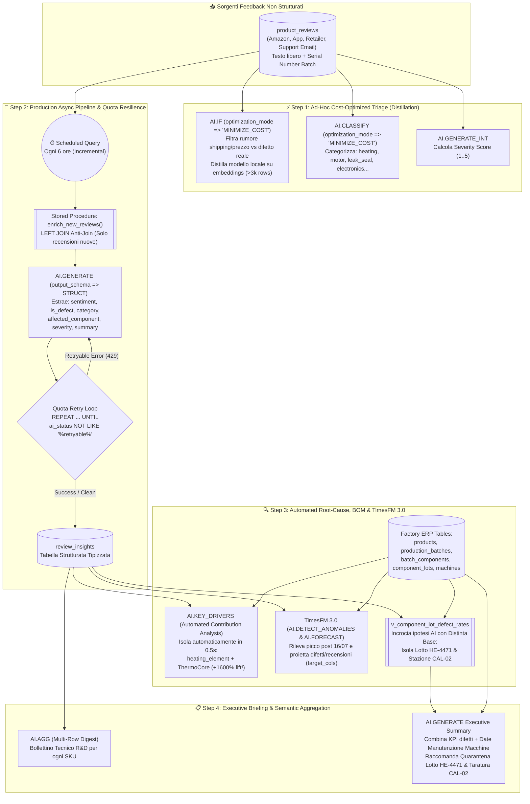

# Lab II: Unstructured Product Review Intelligence — Disegno Architetturale & Slide Deck

**Evento:** Applied AI & Data Hackathon — Google Milan (13 Ottobre 2026)  
**Orario Sessione:** 11:30 AM – 12:30 PM CEST (60 minuti)  
**Target Environment:** BigQuery (`mfg_quality_demo`, EU) + Vertex AI (`gemini-3.8-flash`, `text-embedding-005`, `TimesFM 3.0`)

---

## 🏗️ 1. Disegno Architetturale End-to-End

Il diagramma seguente illustra l'architettura **Production-Grade AI in SQL** per il Lab II (NovaHome Appliances), evidenziando i meccanismi nativi di **Model Distillation (`MINIMIZE_COST`)**, **Quota-Error Retry Loop**, **Automated Contribution Analysis (`AI.KEY_DRIVERS`)**, **TimesFM 3.0 Multivariate Forecasting** e **Root-Cause Tracing sulla Distinta Base (BOM)**.



---

## 📽️ 2. Set di Slide (10 Slide per i 60 Minuti di Lab)

### Slide 1 — Titolo & Visione del Lab II
* **Titolo:** Dal Testo Libero alla Macchina di Fabbrica: Root-Cause Analysis con BigQuery AI
* **Sottotitolo:** Hands-on Lab II — Applied AI & Data Hackathon (11:30 – 12:30)
* **Speaker Notes / Messaggio Chiave:**
  * Nel secondo laboratorio affrontiamo il problema universale dei dati non strutturati: migliaia di recensioni clienti, ticket di supporto e feedback sparsi su Amazon, app mobile ed email.
  * Obiettivo: mostrare come trasformare il rumore testuale in **segnali ingegneristici tipizzati** e incrociarli con la **Distinta Base (Bill of Materials)** per scoprire quale macchinario di stabilimento sta causando un difetto sul campo — il tutto con **architettura di produzione resiliente ai limiti di quota e ottimizzata nei costi**.

---

### Slide 2 — Il Caso di Studio: NovaHome Appliances
* **Titolo:** Il Mistero dei Bollitori NovaHome: Design Difettoso, Fornitore Scadente o Macchina Starata?
* **Scenario di Business:**
  * NovaHome produce bollitori elettrici (`KTL-100`, `KTL-200`), macchine da caffè, frullatori e friggitrici ad aria.
  * Nelle ultime settimane i canali di vendita registrano decine di reclami (*"acqua tiepida dopo 10 giorni"*, *"si spegne prima di bollire"*).
  * **La Domanda Cruciale per il Quality Engineering:**
    1. È un problema di progettazione del nuovo modello Smart Kettle (`KTL-200`)?
    2. È colpa del fornitore delle resistenze (`ThermoCore` vs `Calorix`)?
    3. Oppure dipende da **una specifica stazione di calibrazione nello stabilimento**?

---

### Slide 3 — Fase 1 (10 min): Triage Istantaneo e "Model Distillation" (`MINIMIZE_COST`)
* **Titolo:** Come Interrogare un LLM su Milioni di Righe Senza Esplodere il Budget
* **Lo Showstopper Tecnico (`sql/02_quick_triage.sql`):**
  * Usiamo le nuove funzioni scalari semantiche `AI.IF` (booleana) e `AI.CLASSIFY` (categorica) con il parametro:
    ```sql
    optimization_mode => 'MINIMIZE_COST'
    ```
* **Come Funziona la Distillazione Automatica in BigQuery:**
  1. **Sampling:** BigQuery invia un campione rappresentativo di righe a Gemini 3.8 Flash.
  2. **Distillation:** Addestra dietro le quinte un modello locale leggero basato sugli *embeddings* del testo usando le risposte di Gemini come label.
  3. **Quality Check & Serving:** Valida l'accuratezza; se superata (da ~3.000+ righe), serve il 90%+ della tabella dal modello distillato locale a una frazione del costo e della latenza!

---

### Slide 4 — Fase 2 (15 min): Estrazione Strutturata Tipizzata con `output_schema`
* **Titolo:** Addio Regex e JSON Parsing Fragili: Benvenuti `STRUCT` Tipizzati
* **Il Problema Storico dei Prompt LLM:** Chiedere a un LLM *"rispondi in JSON"* porta inevitabilmente a errori di parsing su larga scala (`JSON_EXTRACT` falliti, backtick markdown, campi mancanti).
* **La Soluzione (`sql/03_async_enrichment_pipeline.sql`):**
  ```sql
  AI.GENERATE(
    prompt => CONCAT('Analyze this customer review... Review: ', r.review_text),
    connection_id => 'us.vertex_ai_conn',
    endpoint => 'gemini-3.8-flash',
    output_schema => 'sentiment STRING, is_defect_report BOOL, defect_category STRING, affected_component STRING, severity INT64, summary STRING'
  ) AS g
  ```
* **Vantaggio:** BigQuery impone lo schema a livello di decodifica Vertex AI (Controlled Generation) e restituisce direttamente colonne SQL tipizzate (`g.is_defect_report`, `g.affected_component`, `g.severity`).

---

### Slide 5 — Fase 2b: Resilienza agli Errori di Quota in Produzione (`REPEAT ... UNTIL`)
* **Titolo:** Cosa Succede Quando 50.000 Recensioni Colpiscono il Rate Limit di Vertex AI?
* **Il Comportamento Intelligente di BigQuery:** Quando una chiamata supera la quota RPM/TPM (Errore 429), BigQuery **non fa fallire l'intera query SQL**: scrive la riga e popola la colonna di sistema `status` con `'A retryable error occurred: ...'`.
* **Il Pattern Ufficiale di Auto-Guarigione (`enrich_new_reviews`):**
  ```sql
  REPEAT
    DELETE FROM review_insights WHERE ai_status LIKE '%A retryable error occurred%';
    INSERT INTO review_insights SELECT ... FROM product_reviews r LEFT JOIN review_insights i USING (review_id) WHERE i.review_id IS NULL;
    SET attempts = attempts + 1;
  UNTIL retryable_rows = 0 OR attempts >= max_attempts END REPEAT;
  ```
* **Risultato:** Le righe andate a buon fine **non vengono mai ricalcolate né ri-fatturate**. Solo i fallimenti temporanei vengono riprovati!

---

### Slide 6 — Fase 3 (15 min): Dalla Recensione alla Fabbrica (Join con la Distinta Base)
* **Titolo:** Il Vero Valore del Data Warehouse: Unire l'Ipotesi AI ai Dati ERP di Fabbrica
* **Concetto Chiave:** Il sentiment da solo produce una bella dashboard. Ma unire il campo `affected_component` estratto dall'AI con la tabella `batch_components` (Bill of Materials) trasforma il testo libero in **diagnostica industriale**.
* **L'Evidenza Numerica (`v_component_lot_defect_rates` - `sql/04_root_cause_analysis.sql`):**
  * Lotto **`HE-4471`** (Resistenza termica, fornitore *ThermoCore*, calibrata su **`CAL-02`**): **77% di recensioni difettose** (17 su 22, severity media 4.5/5).
  * Lotto **`GSK-770`** (Guarnizione, *FlexiSeal*, pressa `SEAL-01`): **67% di difetti** (perdite d'acqua).

---

### Slide 7 — Fase 3b: Il "Control Check" Scientifico & `AI.KEY_DRIVERS`
* **Titolo:** È Colpa del Fornitore ThermoCore o della Stazione di Calibrazione `CAL-02`?
* **1. La Prova Relazionale (`Query 4c`):**
  Confrontiamo i 3 lotti di resistenze termiche:
  * `HE-4471` (*ThermoCore*, calibrato su **`CAL-02`**) $\rightarrow$ **77% difetti**
  * `HE-4472` (*ThermoCore*, calibrato su **`CAL-01`**) $\rightarrow$ **9% difetti**
  * `HE-4398` (*Calorix*, calibrato su **`CAL-01`**) $\rightarrow$ **0% difetti**
  * **Verdetto:** Lo stesso fornitore (*ThermoCore*) funziona perfettamente se calibrato su `CAL-01`! Il colpevole è la stazione **`CAL-02`**, la cui ultima manutenzione risale al **17 Gennaio 2025** (mesi di ritardo!).
* **2. La Scoperta Automatica Zero-Shot (`AI.KEY_DRIVERS` - `sql/07_...sql`):**
  Lanciando `AI.KEY_DRIVERS`, BigQuery esplora tutte le combinazioni dimensionali e segnala in **0.5 secondi** il driver principale: `heating_element + ThermoCore` (**+1600% di incremento difetti**).

---

### Slide 8 — Fase 4 (10 min): Sintesi Multi-Riga (`AI.AGG`) ed Executive Briefing
* **Titolo:** Chiudere il Cerchio: Dai Numeri al Piano d'Azione Esecutivo
* **Due Strumenti di Sintesi per il Management:**
  1. **Bollettino Tecnico per SKU con `AI.AGG` (`sql/07_...sql`):**
     Aggrega semanticamente tutte le recensioni difettose dentro una `GROUP BY sku` per fornire ai progettisti di ciascun prodotto la sintesi tecnica in italiano.
  2. **Executive Briefing Automatico (`sql/05_executive_summary.sql`):**
     Passiamo i dati aggregati della vista `v_component_lot_defect_rates` + le date di manutenzione della tabella `machines` dentro `AI.GENERATE`.
* **L'Output di Gemini:** Un memo di 250 parole per il VP of Quality che:
  * Identifica il lotto `HE-4471` e la stazione `CAL-02`.
  * Cita i tassi di difettosità (77% vs 9%).
  * Ordina 3 azioni: **Quarantena immediata dei lotti su `CAL-02`, Ricalibrazione straordinaria della stazione, Audit congiunto con ThermoCore**.

---

### Slide 9 — Fase 5 (10 min): Live Test della Pipeline Asincrona
* **Titolo:** Vedere la Pipeline in Azione in Tempo Reale (`sql/06_simulate_new_reviews.sql`)
* **L'Esperimento Live per i Partecipanti:**
  1. Inseriamo 3 nuove recensioni appena arrivate (tra cui un nuovo reclamo di mancato riscaldamento sul lotto `HE-4471`).
  2. Mostriamo che le righe sono presenti in `product_reviews` ma non ancora in `review_insights` (il transazionale non è stato rallentato).
  3. Invochiamo `CALL enrich_new_reviews();` (che nella realtà gira schedulata ogni 6 ore).
  4. BigQuery elabora **solo le 3 nuove righe** e aggiorna istantaneamente i KPI della vista `v_component_lot_defect_rates`!

---

### Slide 10 — Riepilogo Architetturale & Takeaway per l'Hackathon
* **Titolo:** I 4 Pilastri del Lab II da Portare nella Vostra Azienda
* **Takeaways:**
  1. **Governance Unificata:** I dati testuali non lasciano mai BigQuery; permessi IAM e lineage restano centralizzati.
  2. **Ottimizzazione Costi (`MINIMIZE_COST`):** Usa la distillazione automatica per classificazioni e filtri booleani ad alto volume.
  3. **Resilienza Nativa:** Implementa sempre il pattern di retry sulla colonna `status` per gestire i picchi di quota Vertex AI.
  4. **Valore Moltiplicativo (AI + ERP + `AI.KEY_DRIVERS`):** L'AI generativa estrae i sintomi dal testo, ma è il Join SQL con i dati aziendali (ERP/BOM) e `AI.KEY_DRIVERS` a trovare la **vera causa radice**.
