# Lab I: Retail Return-Fraud Detection — Disegno Architetturale & Slide Deck

**Evento:** Applied AI & Data Hackathon — Google Milan (13 Ottobre 2026)  
**Orario Sessione:** 10:30 AM – 11:30 AM CEST (60 minuti)  
**Target Environment:** BigQuery (`retail_fraud`, EU) + Vertex AI (`gemini-3.8-flash`, `TimesFM 3.0`)

---

## 🏗️ 1. Disegno Architetturale End-to-End

Il diagramma seguente illustra l'architettura **Agentic Data Cloud** per il Lab I, evidenziando l'integrazione tra **Serie Storiche (TimesFM 3.0)**, **Grafo Relazionale (BigQuery Property Graph GQL)** e **Generative AI Asincrona** direttamente in SQL.

```mermaid
flowchart TB
    subgraph Sources["🛒 Sorgenti Dati Retail (In-Warehouse)"]
        O[("orders & order_items\n(50.000 ordini)")]
        R[("returns\n(4.417 resi + free-text notes)")]
        L[("loyalty_transactions\n(Earn & Redeem points)")]
        E[("Entities: devices,\naddresses, payment_methods")]
    end

    subgraph Pillar1["📈 Step 1: Macro Alert & Risk Forecasting (TimesFM 3.0)"]
        ANOM["AI.DETECT_ANOMALIES\nIntercetta picco anomalo Nov 2025\n(€17.2k/settimana, p=0.973)"]
        FCST["AI.FORECAST (Univariate & Multivariate)\nProiezione esposizione finanziaria\na 8 settimane (€12.4k/wk)"]
    end

    subgraph Pillar2["🕸️ Step 2: Fraud Ring Discovery (BigQuery Property Graph)"]
        PG[["CREATE PROPERTY GRAPH\nretail_fraud.fraud_graph\n(Nodi: Customer, Device, Address, Payment)"]]
        GQL["GQL (GRAPH_TABLE)\nMulti-hop traversal + Behavioral Filter\n(Return Rate >= 40%, >= 3 accounts)"]
        SR[("suspicious_rings\nRING-1 (Wardrobing)\nRING-2 (Loyalty Cycling)\nRING-3 (Empty Box Electronics)")]
    end

    subgraph Pillar3["🤖 Step 3: Asynchronous GenAI Enrichment (Gemini 3.8 Flash)"]
        SCHED(("⏰ Scheduled Query\nOgni 15 min (Async)"))
        BOOL["AI.GENERATE_BOOL / AI.IF\nIncremental Batch Scoring (LIMIT 500)\nSolo resi non ancora analizzati"]
        EXTR["AI.GENERATE_TABLE / output_schema\nEstrazione strutturata da agent_notes\n(claimed_issue, pressure, coordination)"]
        AGG["AI.AGG (Semantic Aggregation)\nSintesi Modus Operandi per Ring\ne Dossier Investigativo (case_summaries)"]
    end

    subgraph Consumption["🎯 Step 4: Decision Intelligence & Agentic Action"]
        DASH[["fraud_dashboard View\nClassifica € a rischio + Evidenze Grafo + Dossier AI"]]
        AGENT["⚡ Data Agent / ADK Fraud Investigator\nConversational Analytics & Azioni Automatiche\n(Blocco carte, Sospensione punti Loyalty)"]
    end

    R --> ANOM
    R --> FCST
    ANOM -.->|"Allerta Spike Q4"| PG
    O & R & L & E --> PG
    PG --> GQL --> SR
    R --> SCHED --> BOOL
    SR & R --> EXTR
    SR & BOOL & EXTR --> AGG
    SR & AGG & FCST --> DASH --> AGENT
```



---

## 📽️ 2. Set di Slide (10 Slide per i 60 Minuti di Lab)

### Slide 1 — Titolo & Contesto dell'Hackathon
* **Titolo:** Smascherare le Frodi Organizzate nel Retail con BigQuery Graph & Generative AI
* **Sottotitolo:** Hands-on Lab I — Applied AI & Data Hackathon (10:30 – 11:30)
* **Speaker Notes / Messaggio Chiave:**
  * Benvenuti al primo laboratorio pratico. Dopo aver visto la visione dell'**Agentic Data Cloud**, oggi costruiamo un sistema antifrode di nuova generazione senza spostare un singolo byte fuori da BigQuery.
  * Obiettivo: passare da controlli a regole statiche a un'investigazione intelligente che unisce **Serie Storiche (TimesFM 3.0)**, **Grafi (GQL)** e **Modelli Generativi (Gemini 3.8 Flash)**.

---

### Slide 2 — Il Problema di Business: Le Frodi Organizzate sui Resi
* **Titolo:** Perché i Sistemi Antifrode Tradizionali Falliscono?
* **Contenuto Visuale (3 Card):**
  1. 👗 **Wardrobing (Ring A):** Acquisto, utilizzo e reso sistematico (68% return rate) con cartellini riattaccati.
  2. 💳 **Loyalty Points Cycling (Ring B):** Acquisto, conversione punti in buoni entro 48h e reso immediato del prodotto.
  3. 📦 **False "Empty Box" Claims (Ring C):** Reclami seriali di "pacco vuoto" su elettronica >€400.
* **Il Gap:** Osservando la singola riga SQL (`SELECT * FROM returns`), ogni reso appare legittimo. Il segnale criminale è nascosto **nelle connessioni tra account diversi** e **nelle sfumature del testo libero** scritto dagli operatori del supporto clienti.

---

### Slide 3 — Architettura "In-Warehouse": Zero ETL, Massima Governance
* **Titolo:** L'Architettura Tradizionale vs. BigQuery Agentic Data Cloud
* **Confronto a due colonne:**
  * ❌ **Approccio Legacy:** Esportare ordini su database a grafo esterno (es. Neo4j) + inviare CSV di note clienti a endpoint NLP via Python + orchestrare pipeline Airflow fragili e costose.
  * ✅ **Approccio BigQuery Native:**
    1. **TimesFM 3.0 (`AI.DETECT_ANOMALIES` & `AI.FORECAST`)** per l'allerta macroeconomica e la proiezione multivariata.
    2. **Property Graph (`CREATE PROPERTY GRAPH`)** direttamente sulle tabelle relazionali esistenti.
    3. **Funzioni AI (`AI.GENERATE*` & `AI.AGG`)** eseguite in batch asincroni via SQL.

---

### Slide 4 — Fase 1 (10 min): L'Allarme Macroeconomico con TimesFM 3.0
* **Titolo:** Da dove inizia l'indagine? Zero-Shot Anomaly Detection & Forecasting
* **Concetto Chiave:** Prima di cercare i colpevoli, il CFO vede un'anomalia nei rimborsi settimanali.
* **Snippet SQL in Evidenza (`sql/13_timesfm_and_ai_agg_enhancements.sql`):**
  ```sql
  SELECT time_series_timestamp, time_series_data, is_anomaly, anomaly_probability
  FROM AI.DETECT_ANOMALIES(
    (SELECT * FROM weekly_returns WHERE week_start < '2025-09-01'),
    (SELECT * FROM weekly_returns WHERE week_start >= '2025-09-01'),
    model => 'TimesFM 3.0',
    data_col => 'weekly_refund_eur', timestamp_col => 'week_start'
  ) WHERE is_anomaly = TRUE;
  ```
* **Risultato Live:** In 3 secondi, **TimesFM 3.0** individua il picco del `2025-11-16` (€17.205 vs max atteso €14.432, probabilità **97.3%**) e con `AI.FORECAST` (univariato e multivariato `target_cols`) proietta €100k+ di perdite nelle successive 8 settimane!

---

### Slide 5 — Fase 2 (15 min): Modellare le Relazioni con BigQuery Property Graph
* **Titolo:** Scoprire i Fili Invisibili con `CREATE PROPERTY GRAPH` e GQL
* **Concetto Chiave:** Nessuna duplicazione dati. Definiamo una vista a grafo sopra le tabelle `customers`, `devices`, `addresses`, `payment_methods`.
* **Snippet SQL (`sql/03_property_graph.sql`):**
  ```sql
  CREATE OR REPLACE PROPERTY GRAPH retail_fraud.fraud_graph
    NODE TABLES (customers KEY (customer_id) LABEL Customer, devices KEY (device_id) LABEL Device, ...)
    EDGE TABLES (customer_devices SOURCE KEY (customer_id) DESTINATION KEY (device_id) LABEL USES_DEVICE, ...);
  ```
* **Pattern GQL:** Con `GRAPH_TABLE(... MATCH (c1:Customer)-[:USES_DEVICE|SHIPS_TO|PAYS_WITH]->(e)<-[:USES_DEVICE|SHIPS_TO|PAYS_WITH]-(c2:Customer))` interroghiamo istantaneamente le condivisioni sospette a 2 o 3 hop di distanza.

---

### Slide 6 — Fase 2b: Dal Grafo ai "Suspicious Rings" (Graph + Comportamento)
* **Titolo:** Separare il Rumore Domestico dai Ring Criminali
* **Il Problema dei Falsi Positivi:** Due coniugi condividono indirizzo e carta di credito. Come distinguiamo una famiglia da una banda?
* **La Soluzione Ibrida (`sql/04_ring_detection.sql`):**
  * **Segnale Topologico (GQL):** Entità condivisa da $\ge 3$ account distinti.
  * **Segnale Comportamentale (SQL):** Ogni membro ha un tasso di reso $\ge 40\%$ e $\ge 3$ resi totali.
* **Output (`suspicious_rings`):** BigQuery isola con precisione chirurgica **3 Ring** (`RING-1`, `RING-2`, `RING-3`) con **zero falsi positivi** sui 50 clienti alto-vendenti legittimi!

---

### Slide 7 — Fase 3 (15 min): Leggere le Note Non Strutturate con GenAI
* **Titolo:** Trasformare il Testo Libero in Dati Tipizzati (`AI.GENERATE_BOOL` & `AI.GENERATE_TABLE`)
* **Concetto Chiave:** Le prove decisive sono nelle note scritte dagli agenti del customer service (`"cartellino riattaccato con pistola diversa"`, `"minaccia chargeback entro 60 secondi"`).
* **Due Pattern Complementari:**
  1. **Classificazione Booleana (`sql/07_async_scoring_batch.sql`):** `AI.GENERATE_BOOL` valuta ogni motivo reso + nota operatore restituendo `is_suspicious = TRUE/FALSE` (Precisione 177/177 sui ring!).
  2. **Estrazione Schema-Enforced (`sql/08_notes_extraction.sql`):**
     ```sql
     STRUCT('claimed_issue STRING, product_condition STRING, refund_pressure STRING, coordination_signal BOOL' AS output_schema)
     ```
     Trasforma paragrafi discorsivi in colonne relazionali pronte per il filtraggio SQL.

---

### Slide 8 — Fase 4 (10 min): Il Pattern Asincrono & Incrementale per la Produzione
* **Titolo:** Come Portare GenAI in Produzione Senza Bloccare il Database né Bruciare Budget
* **Architettura Operativa (`sql/07_async_scoring_batch.sql`):**
  * ❌ Non chiamare mai un LLM in modo sincrono durante il checkout o l'inserimento del reso!
  * ✅ **Pattern Asincrono Incrementale:**
    ```sql
    WHERE NOT EXISTS (SELECT 1 FROM retail_fraud.returns_scored s WHERE s.return_id = r.return_id)
    ORDER BY r.return_id DESC LIMIT 500
    ```
  * Una **Scheduled Query** eseguita ogni 15 minuti processa solo i *nuovi resi arrivati* in coda. Se non ci sono nuovi resi, il costo di esecuzione è **zero**.

---

### Slide 9 — Fase 5 (10 min): Dossier Investigativi & `AI.AGG`
* **Titolo:** Dalla Tabella al Dossier Pronto per l'Azione con `AI.AGG`
* **La Novità `AI.AGG` (`sql/13_timesfm_and_ai_agg_enhancements.sql`):**
  * Invece di concatenare stringhe a mano (`STRING_AGG`), usiamo la nuova funzione nativa di aggregazione semantica multi-riga dentro la `GROUP BY ring_id`:
  ```sql
  SELECT sr.ring_id, sr.refund_exposure,
         AI.AGG(STRUCT(r.return_reason_text, r.agent_notes),
                'Sintetizza in 2 frasi il Modus Operandi comune e raccomanda 1 azione immediata.')
  FROM suspicious_rings sr, UNNEST(sr.members) customer_id JOIN returns r USING (customer_id)
  GROUP BY 1, 2;
  ```
* **Risultato:** La vista `fraud_dashboard` presenta i 3 ring ordinati per € a rischio con il profilo criminale completo e la raccomandazione operativa (es. *"Sospendere riscatto punti loyalty fino a verifica merce in magazzino"*).

---

### Slide 10 — Conclusioni & Evoluzione verso gli Agenti (Agentic Data Cloud)
* **Titolo:** Cosa Abbiamo Costruito in 60 Minuti (e il Passo Successivo)
* **Takeaways per il Partecipante:**
  1. **TimesFM (`AI.DETECT_ANOMALIES` / `AI.FORECAST`)** ti dà la vista radar macroeconomica in zero-shot.
  2. **BigQuery Property Graph (GQL)** rivela le reti criminali nascoste nei tuoi dati relazionali.
  3. **GenAI Asincrona (`AI.GENERATE*` / `AI.AGG`)** legge e struttura migliaia di documenti non strutturati a costi minimi.
* **Next Step (Agentic):** Collegando il dataset `retail_fraud` a **BigQuery Data Canvas / Conversational Analytics** o a un agente **ADK (Agent Development Kit)**, gli analisti investigano dialogando in linguaggio naturale e delegano all'agente l'apertura automatica dei ticket di blocco account!
