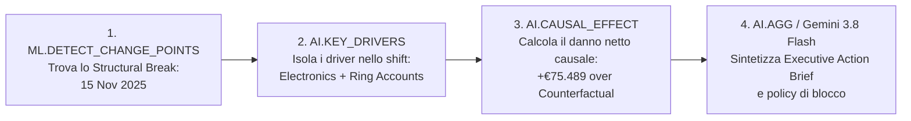

# Bonus Pack: BigQuery Augmented Analytics Table-Valued Functions (TVFs)
**Guida Ufficiale & Pattern di Utilizzo per l'Applied AI & Data Hackathon**  
*Riferimento:* [Google Cloud Blog: "Agent-ready analytics: Unlocking insights with BigQuery augmented analytics"](https://cloud.google.com/blog/products/data-analytics/bigquery-augmented-analytics-tvfs?e=48754805)

---

## 🎯 Perché questo Bonus Pack è in Lab I (`retail_fraud`)?
Nel **Lab I** investigiamo una rete complessa di frodi organizzate sui resi e-commerce. La sfida principale per un team di Fraud Intelligence o per un **Data Agent autonomo** è rispondere a 4 domande critiche:
1. **QUANDO è iniziato lo shift anomalo?** (Non un semplice picco isolato, ma un vero cambio di regime strutturale).
2. **QUAL È IL TREND REALE e la STAGIONALITÀ ORDINARIA?** (Separare la normale ondata di resi post-weekend/natalizia dalle frodi).
3. **COSA HA GUIDATO LO SHIFT?** (Quali segmenti di clienti e categorie di prodotto hanno causato l'impennata).
4. **QUAL È STATO L'IMPATTO ECONOMICO CAUSALE NETTO?** (Isolare il danno reale rispetto a cosa sarebbe accaduto organicamente senza l'attacco).

BigQuery include una suite di **Table-Valued Functions (TVFs) di Augmented Analytics** che consentono di risolvere queste domande direttamente in SQL, senza esportare dati, senza librerie Python (statsmodels, Prophet, CausalPy) e senza addestrare modelli BQML complessi.

---

## 🧭 Le 6 Funzioni di Augmented Analytics a Confronto

| Funzione TVF | Cosa ti permette di scoprire | Domanda di Business a cui risponde | File di Riferimento nel Lab |
|---|---|---|---|
| **`ML.DETECT_CHANGE_POINTS`** | Identifica date o intervalli specifici in cui una metrica subisce un **cambio di regime strutturale** persistente. | *"In quali date precise i rimborsi hanno subito uno shift sistematico rispetto ai pattern storici?"* | [14_augmented_analytics_bonus_pack.sql](sql/14_augmented_analytics_bonus_pack.sql) (Query 1) |
| **`ML.TREND`** | Separa il **trend di fondo secolare** di crescita o declino dal rumore e dalle fluttuazioni casuali, con forecasting. | *"Qual è il trend reale di fondo dei rimborsi e quale sarà la traiettoria attesa per i prossimi 7 giorni?"* | [14_augmented_analytics_bonus_pack.sql](sql/14_augmented_analytics_bonus_pack.sql) (Query 2) |
| **`ML.SEASONALITY`** | Isola i **cicli periodici ripetuti** (orari, giornalieri, settimanali, mensili, trimestrali). | *"Qual è l'impatto del giorno della settimana sui rimborsi da non scambiare per frode?"* | [14_augmented_analytics_bonus_pack.sql](sql/14_augmented_analytics_bonus_pack.sql) (Query 3) |
| **`AI.KEY_DRIVERS`** | Identifica i **fattori dimensionali chiave** responsabili di un incremento o calo tra due periodi o coorti. | *"Quali categorie merceologiche e segmenti clienti spiegano l'impennata del Q4?"* | [14_augmented_analytics_bonus_pack.sql](sql/14_augmented_analytics_bonus_pack.sql) (Query 4)<br>*Vedi anche Lab II: 07* |
| **`AI.CAUSAL_EFFECT`** | Quantifica l'**impatto causale netto** di un evento o policy confrontando i dati reali con un controllo controfattuale. | *"Quanto del picco di rimborsi è causato specificamente dall'ondata di frode rispetto alla crescita organica?"* | [14_augmented_analytics_bonus_pack.sql](sql/14_augmented_analytics_bonus_pack.sql) (Query 5) |
| **`ML.CORRELATION`** | Calcola la **matrice di correlazione statistica** (Pearson, Spearman) tra coppie di metriche, anche per dimensione. | *"Quanto correla il tasso di reso con il volume degli ordini o l'ammontare dei rimborsi nei vari segmenti?"* | [14_augmented_analytics_bonus_pack.sql](sql/14_augmented_analytics_bonus_pack.sql) (Query 6) |

---

## 🔗 Il Pattern di "Chaining": Come collegare le TVF per Data Agents

Il vero potere dell'Augmented Analytics risiede nella possibilità di **concatenare (chaining)** l'output di una funzione come input della successiva:



1. **Step 1 — Scoperta Temporale:** `ML.DETECT_CHANGE_POINTS` scandaglia lo storico e trova la data esatta (`2025-11-15`) in cui la media giornaliera dei resi è passata a un livello superiore persistente.
2. **Step 2 — Diagnosi Dimensionale:** Passiamo la finestra temporale post-break ad `AI.KEY_DRIVERS`, che confronta il gruppo di interesse con la reference window e individua immediatamente le dimensioni colpevoli (`product_category = 'Electronics'` e segmenti a rischio).
3. **Step 3 — Quantificazione Causale:** Con `AI.CAUSAL_EFFECT` inseriamo `intervention_timestamp => TIMESTAMP '2025-11-15'` e otteniamo l'impatto economico netto (**+€75.489**) rispetto a una stima controfattuale sintetica.
4. **Step 4 — Azione Esecutiva:** I risultati vengono passati a `AI.AGG` e Gemini 3.8 Flash per generare il piano operativo di contrasto.

---

## 💻 Esempi di Codice & Output Reali dal Workshop

### 1. `ML.DETECT_CHANGE_POINTS`
```sql
WITH daily_returns AS (
  SELECT return_date, ROUND(SUM(refund_amount), 2) AS daily_refund_eur
  FROM `retail_fraud.returns`
  GROUP BY 1
)
SELECT
  begin_timestamp,
  end_timestamp,
  metrics.count AS duration_days,
  ROUND(metrics.avg, 2) AS avg_daily_refund_eur,
  ROUND(metrics.max, 2) AS max_daily_refund_eur
FROM ML.DETECT_CHANGE_POINTS(
  TABLE daily_returns,
  data_col => 'daily_refund_eur',
  timestamp_col => 'return_date'
)
ORDER BY begin_timestamp DESC;
```
* **Output:** Rileva istantaneamente l'intervallo con salto di media a €1.805/giorno (con picco a €2.714).

---

### 2. `ML.TREND` & `ML.SEASONALITY`
```sql
-- Decomposizione Trend e proiezione a 7 giorni
SELECT return_date, time_series_type, ROUND(daily_refund_eur, 2), ROUND(trend, 2)
FROM ML.TREND(
  TABLE daily_returns,
  data_col => 'daily_refund_eur',
  timestamp_col => 'return_date',
  horizon => 7,
  adjust_step_changes => TRUE
)
ORDER BY return_date DESC LIMIT 7;

-- Componente stagionale settimanale
SELECT return_date, FORMAT_DATE('%A', return_date) AS day_of_week, ROUND(weekly, 2) AS weekly_seasonal_eur
FROM ML.SEASONALITY(
  TABLE daily_returns,
  data_col => 'daily_refund_eur',
  timestamp_col => 'return_date'
)
ORDER BY return_date DESC LIMIT 7;
```
* **Perché:** Permette a un algoritmo antifrode di sottrarre il fisiologico incremento del giovedì (+€2.29/ordine) prima di valutare se una transazione è anomala.

---

### 3. `AI.CAUSAL_EFFECT`
```sql
SELECT
  ROUND(prob_causal_effect * 100, 1) AS prob_causal_impact_pct,
  ROUND(absolute_effect, 2) AS cumulative_causal_impact_eur,
  ROUND(relative_effect * 100, 1) AS relative_lift_over_counterfactual_pct
FROM AI.CAUSAL_EFFECT(
  (SELECT TIMESTAMP(return_date) AS return_ts, SUM(refund_amount) AS daily_refund_eur FROM `retail_fraud.returns` GROUP BY 1),
  data_col => 'daily_refund_eur',
  timestamp_col => 'return_ts',
  intervention_timestamp => TIMESTAMP '2025-11-15 00:00:00',
  output_time_series => FALSE
);
```
* **Output:** Calcola che l'impatto causale cumulato è pari a **€75.489 (+19.9% di scostamento)** rispetto a cosa avrebbe generato la domanda organica nello stesso arco temporale.

---

### 4. `ML.CORRELATION`
```sql
SELECT corr_col, target_col, ROUND(correlation, 3) AS pearson_corr, segment_size
FROM ML.CORRELATION(
  TABLE customer_aggregates,
  target_col => 'total_returns',
  target_correlation_cols => ['total_orders', 'total_refunds']
);
```
* **Output:** Conferma una forte correlazione lineare tra `total_returns` e `total_refunds` (**0.852**) ma una debole correlazione con `total_orders` (**0.290**), evidenziando che i clienti ad alto rimborso non sono i clienti con più ordini (segnale classico di account dedicati esclusivamente all'abuso).

---

## 🚀 Come Eseguire il Bonus Pack
Lo script è pronto e autosufficiente nel repository:
```bash
bq query --location=US --use_legacy_sql=false < retail_fraud/sql/14_augmented_analytics_bonus_pack.sql
```
Tempo di esecuzione totale: **~8 secondi**.
